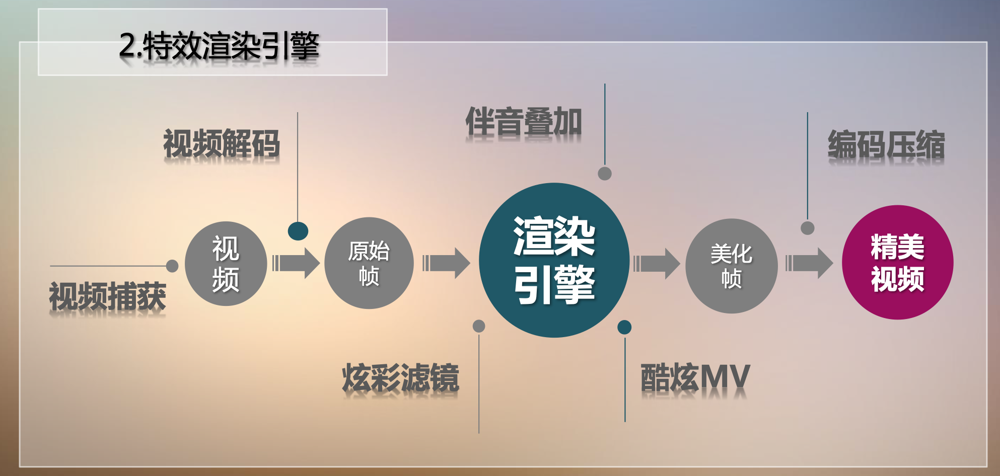
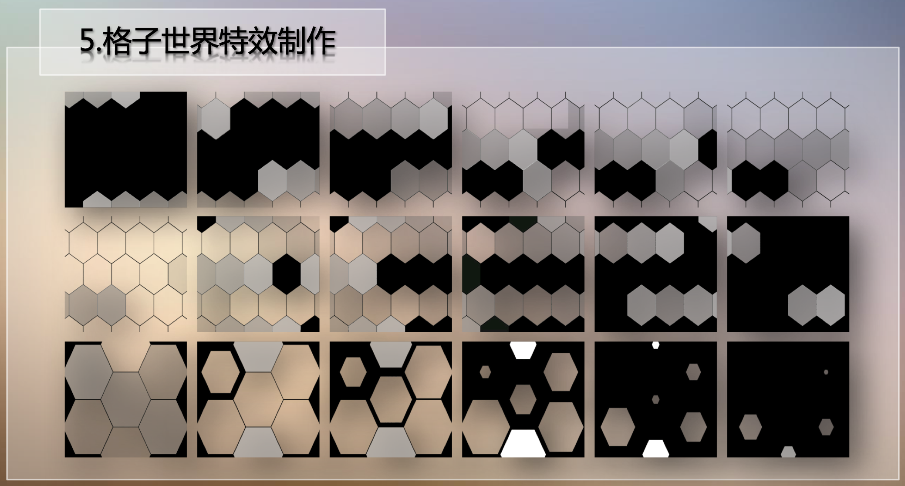
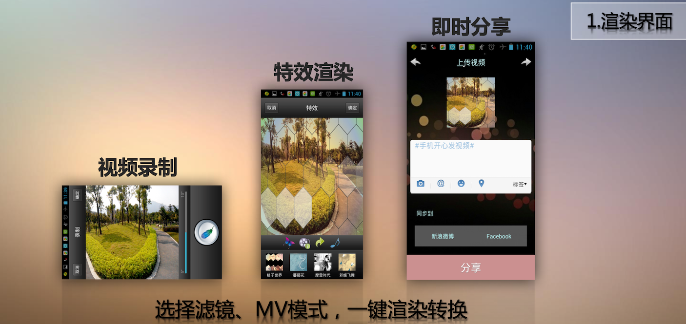

# VideoEffectRendering

## Video Effect Animation based on FFMPEG and JNI
This is an androind app for video effect rendering. This rendering engine utilizes FFMPEG C library to decode the video to raw images and encode the filtered images to the new video, and exposes the C interfaces to JAVA through Java Native Interface (JNI). This ensures sufficiently fast video processing performance. We also design several effects for image filtering and video animation. Note that this engine is now integrated to another project (https://github.com/QibingLee/LifeEnergy), which is a social network video sharing app.

## Notice
It is built four years ago, and therefore some functions may be deprecated.

## Technical Details
The rendering procedure of video effect:

The animation resources for “lattice world” effect (in ./effects folder, @hexogon_pattern):

## Demo Video
You can watch the youtube video for this engine:

https://www.youtube.com/watch?v=1cEIneTFN0U

https://www.youtube.com/watch?v=7lzg2ES1MxU

https://www.youtube.com/watch?v=g1fMsfgPgxU

https://www.youtube.com/watch?v=iM-MYYpxxsI

